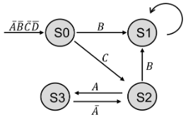

# Design and Security verification of a Finite State Machine
## Main objective 
The reason that cybersecurity is such an important concern is that implementing a system correctly is very
difficult. In real hardware and firmware development, companies pay lots of money for engineers who can help verify system
correctness. This project gives you a taste of hardware validation and verification.
## Background 
Security requirements can be viewed as a special subset of correctness requirements. In other words, it makes
no sense to talk about the security of a hardware IP unless you can first guarantee that the IP performs its function correctly.
Moreover, the same tests used to verify that an IP is implemented correctly might be useful for finding trojans.

Functional testing is the simplest way to guarantee that a design implements its specification correctly, but functional testing
can only guarantee the design’s behavior for a specific (sequence) of inputs. Formal modeling and verification can provide
stronger guarantees about the design’s behavior when it is supplied with inputs that have not been functionally tested.

Consider the following Finite State Diagram that has 4 inputs and 4 states. Assume that only one input can change per clock
cycle. Note that all state transitions are not explicitly indicated; if an input changes that does not cause a state transition, the
FSM remains in its current state. You are required to implement the RTL design and perform functional and property-based
security verification of this FSM circuit.

## Project Goal 
  

Design the FSM in RTL code and verify it using both conventional tests (a “test bench”) and formal approaches.
Both undergraduates and graduates should attempt to implement as rigorous a testbench as possible. For the formal verication
portion, undergraduates will implement five assertions to-be-checked in Jaspergold and graduate students will implement ten.
You may find errors or bugs in your initial design. If you do, fix your FSM implementation and re-run the tests.

### Directory Specifications:

- [FSM_V1](FSM_V1) : Contains the initial design and testbench
- [FSM_V2](FSM_V2) : Updated design and testbench
- [FSM_V3](FSM_V3) : Final design and testbench.
- [Properties](properties) : Contains the assertion files and tcl script.
- [Images](Images) : Contains the images used in this readme file.
- [Group5_Report.pdf](https://github.com/Daniyal-Tahsildar/FSM_SECURITY_VERIFICAATION/blob/1dc113b084539e79567d35ed2802e036a82326b4/Group5_Report.pdf) : Project report.
